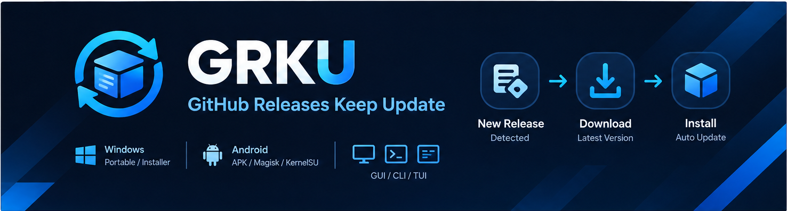

# GRKU · GitHub Releases Keep Update



自动追踪 GitHub Release，检测到新版本后按**平台 + 策略**下载并安装的跨平台工具。
同一套核心逻辑提供 **GUI（Flutter）**、**CLI** 与 **TUI** 三种界面。

📖 **代码文档**：[doc/README.md](doc/README.md)（架构总览 / 配置体系 / 更新编排 / 平台实现 / GUI / CLI / CI 发布，含目录）

## 功能
当前已实现windows和Android双平台
- **多平台更新策略**
  - Windows：Portable（zip/7z 解压覆盖（可排除配置文件）、或**单文件 exe** 直接替换）、Installer（msi / setup.exe 静默安装）
  - Linux：Portable（tar.gz、**单文件 AppImage**）、Docker（拉取镜像并重建容器）
  - Android：APK 安装（root / Shizuku 静默安装，或**系统安装器**普通安装）、Magisk / KernelSU 模块刷入
- **已装版本识别**：读取设备上真实安装的版本（Android 应用 versionName、Magisk 模块 `module.prop`、便携目录的版本记录文件），无 v 前缀等写法差异也能正确比对
- **签名一致性校验**：Android 安装前比对 APK 与已装应用签名；可开启「无视签名强制安装」（`pm uninstall -k` 保留应用数据后重装）
- **下载**：多线程分块 + 断点续传，可中断/暂停；镜像改写加速；可选校验和（sha256/md5）
- **安装重试**：下载成功但安装失败时，可仅重试安装而无需重新下载
- **规则库**：按 Windows / Linux / Android 三系统提供预设匹配规则，粘贴 GitHub 链接即自动解析 owner/repo
- **数据保护**：portable 覆盖更新时可指定需保留的**数据目录**与**数据文件**（支持多条正则）
- **通知**：系统通知 + Webhook（可选触发事件）
- **后台自动检测**：全局检测间隔（默认 6 小时）可在设置中调整，单个仓库可单独覆盖或关闭；检测到新版本时发系统通知
- **后台保活 + 常驻通知栏**：Android 用原生前台服务（常驻通知，进程保活，通知中显示下次检测时间）；Windows / Linux 开启后关闭窗口不退出，继续按间隔检测
- **仓库展示**：可为仓库设置**自定义显示名称**；Android 仓库默认开启「下载 APK 后自动获取图标与软件名称」（仅 Android 可见），**优先复用本地已下载的 APK**，未下载过且已安装版本与仓库一致时自动从**已安装的应用**读取；图标保存为下载目录下的 `app_icon.png`、名称/包名/版本写入 `app_name.txt`；列表中图标 + 主标题为该名称（自定义名称优先，其次为获取到的软件名）、「作者/仓库名」以次一级字体显示在下一行，并显示**已下载版本 / 已安装版本**；未设置名称则只显示作者/仓库名
- **Android 权限管理**：存储（所有文件访问）、通知、root、Shizuku 的检测与申请

## 构建

```bash
flutter pub get

# Windows GUI
flutter build windows --release

# CLI / TUI（单文件可执行）
dart compile exe bin/grku.dart -o build/grku.exe

# Android（分 ABI + 通用包）
flutter build apk --release --split-per-abi
flutter build apk --release
```

## 使用

```bash
# GUI
build/windows/x64/runner/Release/github_releases_keep_update.exe

# CLI
grku list                     # 列出仓库
grku check                    # 检测可更新项
grku update                   # 下载并安装
grku retry                    # 仅重试安装（复用已下载文件）
grku add --platform windows --repo owner/repo --strategy portable --regex ".*windows.*\.zip$"
grku config import <file>     # 导入配置（空配置会被拦下）
grku config export <file>     # 导出配置
grku tui                      # 交互式终端界面
```

配置分为两个文件：**软件配置** `config.yaml` 与**仓库配置** `repos.yaml`（同目录、均为 `configVersion: 4`）。旧版单文件配置（v1–v3）在每次启动时自动检测并转换，原文件备份为 `config.yaml.bak`；导入/导出仍是单个合并文件，便于分享。示例见 `example_config.yaml`。

## 可视化 UI 编辑器（开发期工具）

在项目根目录运行：

```bash
dart run tool/ui_editor.dart                     # 自动分配端口并打开浏览器
dart run tool/ui_editor.dart --port 8765 --no-open
dart run tool/ui_editor.dart --host 0.0.0.0      # 让同网段的手机/平板也能访问
```

浏览器里从左侧拖拽组件、在右侧调属性，点「保存」即生成 `lib/ui/generated/<类名>.dart`；
对正在运行的 `flutter run` 热重载就能看到效果。同一份设计会存为 `<类名>.design.json`
sidecar，下次可以重新打开继续编辑。

- 服务默认**只监听 `127.0.0.1`**，每次运行生成随机访问令牌（在启动时打印的 URL 里，勿分享）；
  加 `--host 0.0.0.0` 才暴露到局域网，此时会额外打印局域网地址并给出安全提示——同网段任何人
  都能打开页面，令牌等同于密码。无论绑哪里，`Host` 头都只接受 `localhost` 与 IP 字面量
  （挡 DNS rebinding），并且拒绝 `OPTIONS` 预检、不发 CORS 头。
- 写入被限制在 `lib/ui/generated/`；同名文件已存在时需显式确认覆盖。
- 组件目录（`tool/ui_editor/widget_catalog.dart`）是编辑器与代码生成器的唯一事实来源，
  `GET /api/palette` 直接下发，新增组件无需改前端 JS。
- 生成的代码按项目 lint 规则**构造即合规**（`const` 传播、按需 import、单引号、构造器在 `build` 前），
  可以直接提交而不会让 `flutter analyze` 变红；`tool/` 与 `lib/ui/generated/` 都在 analyzer 范围内。
- 设计稿 sidecar 与生成的 `.dart` **都应提交**，不要写进 `.gitignore`。
- 这是**开发期**工具：安装版（exe / apk）没有 `lib/` 源码，无法使用；生成的界面需要重新编译（或热重载）才生效。

## 开发流程（CI 在 GitHub 上跑）

分析与测试都由 GitHub Actions 负责，本地不必执行 `flutter analyze` / `flutter test`：

1. 改动推到分支并开 PR：CI 只跑「静态分析（零容忍）+ 单元测试」；
2. 检查通过后合并到 `main`：CI 自动构建 Windows GUI / CLI 与 Android 的分 ABI + 通用包；
3. 构建成功且配置了签名密钥时会按 `pubspec.yaml` 的版本号自动创建 Release（同一版本已存在则跳过，可先删旧 Release 再重发）。

本地排查失败时可用 `gh` 读取日志：

```bash
gh pr checks                 # 查看当前 PR 的检查结果
gh run list --limit 5        # 最近的运行
gh run view <run-id> --log-failed   # 只看失败步骤的日志
```

## 目录结构

```
lib/
  core/       配置模型与仓储、GitHub API、资产匹配、下载、更新编排、版本比对、平台桥接
  platforms/  Windows / Linux / Android 更新器装配与原生能力（Android MethodChannel）
  ui/         Flutter GUI（仓库列表、下载、设置）
  ui/generated/ 可视化编辑器生成的界面（见「可视化 UI 编辑器」）
  tui/        终端交互界面
  cli/        命令行入口与子命令
tool/         开发期工具（ui_editor.dart：本地可视化 UI 编辑器）
doc/          代码文档（含目录，见上）
assets/brand/ 图标源图与 README 横幅
test/         单元测试（版本比对、签名校验、配置读写、下载、更新编排等）
vendor/win32  为兼容 Windows 工具链本地化的 win32 包（由 dependency_overrides 指向）
```

## 说明

- Android 端部分能力（权限申请、签名读取、系统安装器）通过 `MethodChannel`（`grku/native`）调用原生实现，见 `android/app/src/main/kotlin/.../MainActivity.kt`
- 日志默认写在用户可访问路径（Android 为 `<外部存储>/grku/logs/app.log`），无写入权限时自动回退到应用私有目录
- 应用图标源图见 `assets/brand/`（Android 启动图标在 `android/app/src/main/res/mipmap-*/`，Windows 为 `windows/runner/resources/app_icon.ico`）
